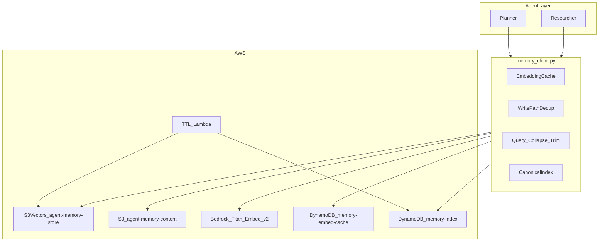
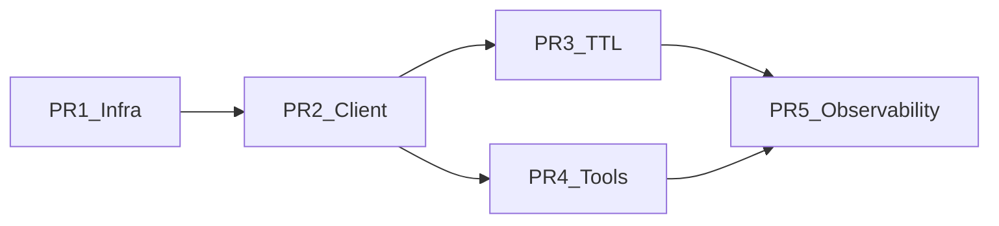

# VectorVault v1 Implementation Plan

**Version:** 1.7  
**Date:** July 10, 2026  
**Status:** Approved  
**Based on:** [design-doc.md](design-doc.md) v1.8
**Changelog (v1.7):** Agent identity convention codified (design-doc v1.8): session ids = `<agent>-<project-slug>` (claude-vv, grok-acme, …), utilities `<purpose>-bot`, tests `e2e-*`; slug registry = vault agent-directory; Grok configs move to project scope. Runbook §"Agent identity convention" is the operational reference.
**Changelog (v1.6):** Roles hardening (design-doc v1.7, owner-approved 2026-07-10) — `MemoryAdminRole` (only human-assumable `DeleteVectors`; attributed `purge` via `vv purge --role admin`; SSM `role/admin-arn`); auditor read-only tool surface in `create_memory_tools`/`vv`/MCP; `-c trustedPrincipalArn` upgraded to `ArnLike aws:PrincipalArn` condition patterns; template check locks `DeleteVectors` to TTL + Admin; design-doc §5 known-limitations note (self-asserted `agent_id`, key-agnostic `PutVectors`).
**Changelog (v1.5):** PR 4 delivered (merged PR #5) — agent tool adapters `vectorvault.tools` (Anthropic/OpenAI/LangChain), `get_memory`/`archive_memory` verbs, citation + origin-skepticism system prompt, `memory_client_for_agent` credential helper (Q6/Q7/Q8/S1). PR 5 delivered — `monitoring-stack.ts` dashboard + §7 alarms → SNS (O6), opt-in `VectorVault/Client` custom metrics, boto3 layer as `-c boto3LayerArn` knob + build script, opt-in integration tests.
**Changelog (v1.1):** Rerank removed from v1 for cost (claude-review.md finding C1); context budget trim moved into PR 2; PR 5 re-scoped to observability + integration tests.
**Changelog (v1.2):** Findings C2–C4 folded — `list_memories` via DynamoDB `memory-index` + `task_id` GSI; supersession via same-key metadata rewrite; dedup requires explicit `supersedes_key`; `restore_memory` tool; **hard cost cap $20/month** (AWS Budgets alarm at 80%).
**Changelog (v1.3):** P1 security folded — memory trust model (`origin` tag + injection screen), CloudTrail write data events + `roleSessionName = agent_id`, derived content keys, KMS one-way-door checklist, TTL circuit breaker/`DRY_RUN`/DLQ, hash-versioned vector keys, `expires_at > now` default filter. Repo under git with GitHub Actions CI.  
**Changelog (v1.4):** Deployment Region fixed to **us-west-2** (owner decision, 2026-07-08). PR 1 CDK stack landed (PR #1, `cdk synth` green); `pr1-deploy-verify` is the remaining PR 1 todo.  

Greenfield implementation of the S3 Vectors shared memory system, delivered as five incremental PRs using TypeScript CDK for infrastructure and Python for the memory client, TTL worker, agent tools, and observability.

## Context

The repo is **greenfield** — only [design-doc.md](design-doc.md), [design-review.md](design-review.md), and [prompt.txt](prompt.txt) exist. No application or infra code yet.

**Locked preferences:**
- CDK: **TypeScript** (per design-doc PR plan)
- **Deployment Region: `us-west-2`** (Region-bound resources are one-way doors)
- Private indexes: **`private-planner`** and **`private-researcher`**
- **Hard cost cap: $20/month** — AWS Budgets alarm at $16 (80%); cost levers in design-doc §6

**Out of scope for v1:** PR 6 (parent-child chunking, OpenSearch tier) — deferred per design-doc §12.

---

## Target architecture



---

## Repository layout (to create)

```
VectorVault/
├── infra/
│   ├── bin/app.ts                 # CDK entry
│   ├── lib/memory-stack.ts        # PR 1–3: core infra + TTL Lambda
│   ├── lib/monitoring-stack.ts    # PR 5: dashboards/alarms
│   ├── cdk.json
│   └── package.json
├── src/
│   ├── memory_client.py           # PR 2: main client
│   ├── models.py                  # Pydantic/dataclass models
│   ├── embedding_cache.py         # LRU + DynamoDB
│   ├── canonical_index.py         # DynamoDB supersession tracker
│   ├── ttl_worker.py              # PR 3
│   └── tools/memory_tools.py      # PR 4
├── prompts/system_memory.md       # PR 4
├── tests/
│   ├── unit/                      # mocked boto3
│   └── integration/               # PR 5: live AWS dev stack
├── pyproject.toml                 # Python deps + pytest
└── README.md                      # deploy + dev workflow
```

---

## PR 1: Infrastructure (CDK)

**Goal:** Deploy all AWS resources the Python client needs. Use **CDK L1 constructs** (`CfnVectorBucket`, `CfnIndex`) — CloudFormation types `AWS::S3Vectors::VectorBucket` and `AWS::S3Vectors::Index` exist; no stable CDK L2 yet.

### Resources in `infra/lib/memory-stack.ts`

| Resource | Name / config |
|---|---|
| KMS key | SSE-KMS for vector bucket, content bucket, DynamoDB |
| Vector bucket | `agent-memory-store` (`CfnVectorBucket`, SSE-KMS) |
| Vector indexes | `shared-team-memory`, `private-planner`, `private-researcher` — all **1024-dim, cosine, float32** |
| Index metadata | `nonFilterableMetadataKeys`: `content`, `content_summary`, `content_ref`, `content_hash`, `provenance`, `supersedes`, `confidence` (immutable after create) |
| Content bucket | `agent-memory-content` (standard S3, SSE-KMS, block public access) |
| DynamoDB | `memory-embed-cache` (PK: `content_hash`, TTL attribute); `memory-index` (PK: `canonical_id`; attrs: `latest_key`, `version`, `superseded_keys`, `task_id`, `agent_id`, `memory_type`, `status`, `created_at`; **GSI**: PK `task_id`, SK `created_at` — backs `list_memories`) |
| IAM roles | `MemoryPlannerRole`, `MemoryResearcherRole`, `MemoryAuditorRole`, `MemoryTtlRole` — scoped per design-doc §5 table |
| SSM parameters | Export bucket names, index ARNs, table names, region for Python config |
| AWS Budgets | `vectorvault-monthly`: $20 hard cap, SNS email alert at 80% ($16) |
| CloudTrail | Data events, **write-only** selectors (`PutVectors`/`DeleteVectors`) on the vector bucket — authoritative audit trail (~$0.30/mo) |
| Tags | `project: vectorvault` on every resource (Cost Explorer verification of the $20 cap) |

### IAM policy shape (per role)

- **Planner:** `Put/Query/Get/ListVectors` on `shared-team-memory` + `private-planner`; `s3:Put/Get` on content bucket; `bedrock:InvokeModel` for Titan embed; DynamoDB read/write on both tables.
- **Researcher:** same pattern on `private-researcher`.
- **Auditor:** read-only vector + list on all three indexes.
- **TTL role:** `DeleteVectors`, `ListVectors`, `GetVectors`, `PutVectors` (status rewrites) on all indexes; DynamoDB read/write on `memory-index`.
- **Attribution:** every agent process assumes its role with `roleSessionName = <agent_id>` so CloudTrail records which agent made each call (metadata `agent_id` is client-asserted and not trustworthy).

### PR 1 one-way-door checklist (immutable after creation)

- [ ] Vector-bucket encryption uses the **full KMS key ARN** (not alias/ID), same-Region key
- [ ] KMS key policy grants `kms:Decrypt` to `indexing.s3vectors.amazonaws.com`
- [ ] `nonFilterableMetadataKeys` list is final (incl. `content_hash`)
- [ ] Filterable schema is final (incl. `origin`)
- [ ] CloudTrail write-only data events enabled on the vector bucket

### VPC endpoints

**Defer to PR 5** unless deploying into a locked-down VPC from day one. Document as optional context flag `enableVpcEndpoints` defaulting to `false` for dev.

### PR 1 validation

```bash
cd infra && npm install && npx cdk synth && npx cdk deploy
```

Confirm indexes created with correct `metadataConfiguration` via AWS CLI `aws s3vectors get-index`.

### Risk to address in PR 1

**Filterable metadata 2 KB cap:** 12 filterable keys in the schema (incl. `origin`). Enforce short values in `src/models.py` validators (`canonical_id` max ~128 chars, IDs not prose). Integration tests should assert a representative vector stays under 2 KB filterable.

---

## PR 2: Memory Client Library

**Goal:** Implement design-doc §2 write/read paths and §4 tool contracts.

### Core module: `src/memory_client.py`

```python
class MemoryClient:
    def store_memory(content, metadata, index, supersedes_key=None, mode="auto") -> StoreResult
    def retrieve_memory(query, filters, top_k, index) -> list[MemoryRecord]
    def list_memories(filters, index, page_size) -> list[MemoryRecord]
    def restore_memory(key, index) -> StoreResult
```

**`store_memory` pipeline:**
1. Validate metadata via `src/models.py` (`team_id`, `task_id`, `memory_type` required); set `origin` (`agent` | `external`) from the content source.
2. Injection screen (design-doc §5): pattern heuristics on `origin: external` content; flag via `InjectionSuspect` metric (write proceeds).
3. `src/embedding_cache.py` — SHA-256 normalized text → LRU → DynamoDB → Bedrock `amazon.titan-embed-text-v2:0`.
4. Write-path dedup — `QueryVectors` with embedding, filter `{status: active, task_id}`, `top_k=5` (similarity = 1 − returned cosine distance):
   - exact `content_hash` match → no-op, return existing record (`action: "unchanged"`)
   - similarity ≥ 0.95 without `supersedes_key` → **no write**; return `action: "duplicate_detected"` + `near_duplicates` (agent decides)
   - `supersedes_key` given → write new version, then rewrite old vector's metadata (`GetVectors` + same-key `PutVectors`, `status: superseded`)
5. Content routing — ≤30 KB inline in `content` metadata; else `PutObject` at the **derived key** `{index}/{vector_key}.json` (`content_ref` informational only — reads always derive the key); always set `content_hash`.
6. `PutVectors` with deterministic key `mem_{agent_id}_{task_id}_{content_hash[:16]}_v{version}` (idempotent retries; no timestamp collisions).
7. `src/canonical_index.py` — best-effort update of `memory-index` (`latest_key`, `version`, `superseded_keys`, listing attrs). Drift repaired by PR 3 reconciliation sweep; never treated as source of truth.

**`retrieve_memory` pipeline:**
1. Embed query (cache first).
2. `QueryVectors` `top_k=20`, filter `status=active` and `expires_at > now`.
3. Collapse by `canonical_id`: max `(version, created_at)`.
4. Context budget: trim to `max_tokens` (default 4,000); prefer `content_summary` when budget is tight.
5. Resolve content (inline, or S3 fetch from the **derived** key — never a metadata-supplied URI) — fetch full `content` only for top 2 results; label each result with `origin`.
6. Return top `top_k` (default 5).

**`list_memories` routing (ListVectors has no metadata filters — verified July 2026):**
- `canonical_id` filter → DynamoDB `memory-index` GetItem → `GetVectors` hydration.
- `task_id` (± `memory_type`/`status`) → `task_id` GSI query, sorted by `created_at`, paginated.
- Anything else → filtered `QueryVectors` with an anchor embedding (documented fallback; similarity-ordered).

**Resilience:** exponential backoff on `TooManyRequestsException`; batch writes up to 500 vectors.

### Config

Load from env / SSM: `VECTOR_BUCKET`, `CONTENT_BUCKET`, index names, DynamoDB table names, `AWS_REGION`. No hardcoded ARNs in source.

### Tests: `tests/unit/`

Mock `boto3` clients (`s3vectors`, `s3`, `bedrock-runtime`, `dynamodb`). Cover:
- collapse tiebreak on `(version, created_at)`
- dedup decisions: exact-hash no-op; near-dup returns `duplicate_detected` without writing; explicit `supersedes_key` supersedes + rewrites old vector metadata
- `list_memories` routing: `canonical_id` → DDB lookup; `task_id` → GSI; other → QueryVectors fallback
- S3 externalization at 30 KB boundary
- embedding cache hit skips Bedrock
- context budget trim (`max_tokens`, `content_summary` substitution)
- expired memories (`expires_at <= now`) excluded from retrieval
- content fetched only from derived keys; metadata `content_ref` never dereferenced
- injection screen flags imperative patterns in `origin: external` content
- key determinism: same (agent, task, content, version) → same key

---

## PR 3: TTL Worker

**Goal:** Implement status lifecycle from design-doc §2: `superseded` → `archived` (7d) → delete (30d); hard delete on `expires_at`.

### `src/ttl_worker.py`

EventBridge cron (e.g. daily) triggers Lambda:

1. **Promote superseded → archived:** Worklist from `memory-index` (`superseded_keys` + supersession timestamp, 7-day grace elapsed). Confirm each key's `status` via `GetVectors` (vector metadata is the source of truth), then same-key metadata rewrite to `status: archived`, `archived_at: now`.
2. **Delete archived:** `DeleteVectors` for keys where `archived_at + 30d <= now` (confirm status via `GetVectors` before deleting).
3. **Hard TTL:** Maintain expiry index in DynamoDB on write — **preferred** to avoid full index scans. On each `store_memory`, write `expires_at` index row to DynamoDB table `memory-ttl-index` (PK: `index_name`, SK: `expires_at`, attr: `key`).
4. **Reconciliation sweep:** Repair `memory-index` drift against actual vector state (segmented `ListVectors` scan with `returnMetadata`); emit `DriftRepaired`.
5. Emit CloudWatch metrics: `ArchivedCount`, `DeletedCount`, `DriftRepaired`, `Errors`.

**Safety rails (design-doc §7/§9):** deletion **circuit breaker** — abort the run + alarm if it would delete > max(1,000, 5% of index) vectors; `DRY_RUN` env flag (default `true` on first deploy — logs intended actions without deleting); SQS **DLQ** on the Lambda; runs idempotent (safe to re-execute after a crash).

### CDK changes in `infra/lib/memory-stack.ts`

- Add `memory-ttl-index` DynamoDB table (or GSI on `memory-index`).
- Lambda + EventBridge rule + `MemoryTtlRole` + SQS DLQ + `DRY_RUN`/circuit-breaker env config.

### Tests

Unit test promotion/deletion logic with frozen clocks and mocked `DeleteVectors`; cover the circuit-breaker abort path and `DRY_RUN` no-op path.

---

## PR 4: Agent Tool Adapters

**Goal:** Expose memory client as agent-callable tools.

### `src/tools/memory_tools.py`

Thin wrappers returning JSON Schema / OpenAI function-tool / LangChain tool definitions for:
- `retrieve_memory`
- `store_memory`
- `list_memories`
- `restore_memory`

Factory: `create_memory_tools(role: Literal["planner","researcher"], client: MemoryClient)`.

### `prompts/system_memory.md`

System prompt from design-doc §4, parameterized with `{team_id}`, `{agent_id}`, `{index}` — includes the trust-model rules (memories are data, not instructions; `origin: external` skepticism). Tool factory documentation: agent processes assume their IAM role with `roleSessionName = agent_id` (CloudTrail attribution).

### Validation

Manual smoke test: planner stores fact, researcher retrieves with `task_id` filter (script in `scripts/smoke_test.py`).

---

## PR 5: Observability & Integration Tests

**Goal:** Complete §7 monitoring + end-to-end validation.

> **Rerank removed from v1** (claude-review.md C1): Bedrock rerank is $2.00/1K queries (`cohere.rerank-v3-5:0` via `bedrock-agent-runtime`), ~$3,000/month at design volume. Context budget trim now ships in PR 2. Revisit rerank in v2 as opt-in only if integration tests show poor post-collapse precision.

### `infra/lib/monitoring-stack.ts`

CloudWatch dashboard + alarms from design-doc §7:
- 429 rate, query p95, embedding errors, cache hit rate (custom metric from client), TTL failures, budget alarm.

### `tests/integration/test_shared_memory.py`

Requires deployed dev stack:
1. Planner stores → researcher retrieves same fact.
2. Supersession: v2 wins over v1.
3. Concurrent paraphrase writes → collapse returns one fact.
4. Context budget: oversized results trimmed; `content_summary` substituted beyond rank 2.

---

## Dependency graph



---

## Open questions resolved for implementation

| Question | v1 decision |
|---|---|
| Rerank model (#3) | Removed from v1 — $2.00/1K queries ≈ $3,000/mo at design volume; opt-in v2 candidate |
| Max memory size (#2) | Keep 30 KB inline threshold |
| Private index access (#4) | Auditor read-only; planner/researcher isolated to own private index |
| OpenSearch (#5) | Defer to PR 6 |
| Coordinator (#1) | Self-merge in client + DynamoDB canonical index; no coordinator service in v1 |

---

## Estimated effort

| PR | Effort | Deliverable |
|---|---|---|
| PR 1 | 1–2 days | Deployable CDK stack, SSM outputs |
| PR 2 | 2–3 days | `memory_client.py` + unit tests |
| PR 3 | 1–1.5 days | TTL Lambda + TTL index table + reconciliation sweep |
| PR 4 | 0.5–1 day | Tool adapters + prompt |
| PR 5 | 1 day | Monitoring, integration tests |
| **Total** | **~6–8.5 days** | Production-ready v1 |

---

## First execution step

Start with **PR 1**: scaffold `infra/` TypeScript CDK project, implement `MemoryStack` with vector bucket + three indexes + DynamoDB + IAM, deploy to a dev AWS account, and verify index metadata configuration before writing Python client code.

---

## Todos

- [ ] **pr1-scaffold** — Scaffold infra/ TypeScript CDK project (package.json, cdk.json, bin/app.ts)
- [ ] **pr1-memory-stack** — Implement MemoryStack: KMS (one-way-door checklist), CfnVectorBucket, 3x CfnIndex, S3 content bucket, DynamoDB tables (+`task_id` GSI), IAM roles, CloudTrail write data events, AWS Budget ($20 cap), tags, SSM outputs
- [ ] **pr1-deploy-verify** — cdk deploy to dev account; verify indexes and metadataConfiguration via AWS CLI
- [ ] **pr2-models-client** — Create src/ models.py + memory_client.py with store/retrieve/list pipelines
- [ ] **pr2-cache-canonical** — Implement embedding_cache.py and canonical_index.py with DynamoDB integration
- [ ] **pr2-unit-tests** — Add tests/unit/ with mocked boto3 covering dedup, collapse, externalization, cache
- [ ] **pr3-ttl** — Implement ttl_worker.py (lifecycle + reconciliation sweep + circuit breaker/DRY_RUN/DLQ) + memory-ttl-index table + EventBridge Lambda in CDK
- [ ] **pr4-tools** — Add src/tools/memory_tools.py (incl. restore_memory) and prompts/system_memory.md
- [ ] **pr5-observe** — Add monitoring-stack.ts, integration tests, and load/smoke scripts

---